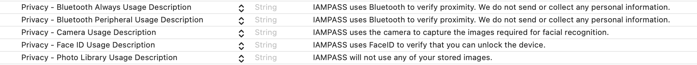

.. _ios_framework:

.. toctree::
   :maxdepth: 2
   :caption: Custom iOS App Guide

Custom iOS App Guide
====================
By default IAMPASS will send authentication requests to the reference IAMPASS mobile application.
IAMPASS Applications can be configured to send authentication requests to custom mobile applications.
In this case the custom application is responsible for:
* Registering the mobile device with IAMPASS
* Collecting the required authentication data in response to authentication requests.

Installation
############
The easiest way to integrate IAMPASS into your application is to use `CocoaPods <https://cocoapods.org>`__.
To integrate IAMPASS into your xCode project using CocoaPods, specify it in your `podfile`.::

    pod 'IAMPASSiOS', '~>0.0.1'

Reference
#########
The IAMPASSiOS framework reference documentation can be found `here <https://iampasstech.github.io/ios_docs/>`__ 

Getting Started
###############
Create an IAMPASS Account and Application
-----------------------------------------------
The first stage in integrating IAMPASS into your applicaton is to create an IAMPASS Application as described :doc:`here<getting_started>`.

**Save the application id and application secret for your IAMPASS Application you will need them to communicate with IAMPASS.**

Add the IAMPASSiOS framework to your project
--------------------------------------------------
To integrate IAMPASSiOS into your xCode project using CocoaPods, specify it in your `podfile`.::

    pod 'IAMPASSiOS', '~>0.1.0'

Application Configuration
#########################
Enable Push Notifications
-------------------------
IAMPASS uses Push Notifications to notify users of Authentication Requests.
Add the `Push Notifications <https://developer.apple.com/documentation/usernotifications>`__ entitlement to your application.

Configure IAMPASS Notifications Credentials
-------------------------------------------------
In order to send Push Notifications to your application you need to configure your IAMPASS:
* Download the APNS certificates for your application from the Apple Developer Portal.
* Import the certificate and private key into KeyChain (both development and production keys).
* Export the certificate and private key from KeyChain as .p12 files.
* Open the `IAMPASS Console <https://main.iam-api.com>`__
* Select your application and click the **Details** button.

  .. image:: ./images/applications.png

* In the details page click the settings icon and select **Notification Settings**.

  .. image:: ./images/applicationdetails.png

* On the Notifications Settings page click the **Edit** button for iOS.

  .. image:: ./images/notificationsettings.png

* On the **Apple iOS Notification Settings** page select **Custom iOS** app from the dropdown.

  .. image:: ./images/customnotification.png

* Update the credentials with your APNS certificate and Private Key.
* Repeat the process for iOS Sandbox using your development credentials.

IAMPASS will now route your users authentication requests to your iOS application.

Applications Entitlements
-------------------------
IAMPASS use Camera and Bluetooth services on your user's mobile device.
You must add the following entries to your application's info.plist.
    

+-------------------------------------------+-----------------------------------------------------------------------+
| key                                       |     value                                                             |
+===========================================+=======================================================================+
|  NSBluetoothAlwaysUsageDescription        |   uses Bluetooth to verify proximity                                  |
+-------------------------------------------+-----------------------------------------------------------------------+
|  NSBluetoothPeripheralUsageDescription    |   uses Bluetooth to verify proximity                                  |
+-------------------------------------------+-----------------------------------------------------------------------+
|  NSCameraUsageDescription                 |   uses the camera to capture images required for facial recognition.  |
+-------------------------------------------+-----------------------------------------------------------------------+
|  NSFaceIDUsageDescription                 |   uses FaceID to verify that you can unlock your phone.               |
+-------------------------------------------+-----------------------------------------------------------------------+
|  NSPhotoLibraryUsageDescription           |   will not use any of your stored images.                             |
+-------------------------------------------+-----------------------------------------------------------------------+

Background Modes
----------------
Add the Background Modes entitlement to your application in xCode.
Enable the following modes:

* Acts as a Bluetooth LE accessory
* Remote Notifications

.. image:: ./images/backgroundmodes.png

Key Concepts
############

When a system uses IAMPASS to authenticate its users:
    * A notification is sent to the users registered device.
    * The registered device collects the required information and send it to IAMPASS.
    * IAMPASS processes the collected data and makes an authentication decision.

A custom IAMPASS mobile device is responsible for:
    * Registering the user's device.
    * Processing notifications from IAMPASS.
    * Collecting the required data.

Registering Users
#################
IAMPASS does not manage your users or replace your sign up flow.
You register your user with IAMPASS by providing a token that you can relate back to your user See :ref:`getting_started` for information about user management.
There are 2 common registration flows:
* User registers using your mobile application.
* User registers externally (in a web browser for example).

**You must wait until your application has completed the Push Notification registration process before registering devices**

Mobile Application Registration
-------------------------------
The IAMPASS iOS framework provides an interface for registering users and their mobile device.
This example assumes that the mobile application has:
* Registered for Push Notifications and stored the returned token in **NOTIFICATION_TOKEN**
* Registered the user **user** with its own system.

.. code-block:: swift

   import IAMPASSiOS

   // user: client generated identifer for the client applications user.
   // NOTIFICATION_TOKEN: The token received by the application when it registers for Push Notifications
   // MY_APPLICATION_ID: The ID of the IAMPASS application (from IAMPASS Console)
   // MY_APPLICATION_SECRET: The Application Secret of the IAMPASS application (from IAMPASS Console)

   // Create an IAMPASS Management API instance using credentials for client application
   let management_api = ManagementAPI(application_id: MY_APPLICATION_ID,application_secret: MY_APPLICATION_SECRET)

    // Register the user with IAMPASS and register this device.
   management_api.create_user_and_register_device(user: user, notification_token: NOTIFICATION_TOKEN) {(user, device) in
       // user: The identifier of the user (same as passed to create_user_and_register_device)
       // device: IPMobileDevice that contains user and device information required for subequent Activeconect calls.

       // This example encodes the IPDeviceData as JSON and stores it in user defaults.
       let encoder = JSONEncoder()
       if let encoded = try? encoder.encode(device){
           let defaults = UserDefaults.standard
           defaults.set(encoded, forKey: "user_data")
           defaults.set(user, forKey: "user_name")
       }
   } failure: { (user, error) in
       // user: The identifier of the user (same as passed to create_user_and_register_device)
       // error: Error that describes failure reason.
   }

External Registration
---------------------
IAMPASS generates custom registration links for associating a device with a user.
The external client application can get the registration link and share it with the mobile application.
It is the client's responsibility to share these links with the mobile application.
Alternatively, the mobile application can provide an interface for the user to enter their username and obtain a registration link.
The IAMPASS iOS framework provides a method to get a registration link for the user

.. code-block:: swift

   import IAMPASSiOS
   ...
   // user_id: client generated identifer for the client applications user.
   // display_name: A readable name for the user (user_id may be a random token)
   // MY_APPLICATION_ID: The ID of the IAMPASS application (from IAMPASS Console)
   // MY_APPLICATION_SECRET: The Application Secret of the IAMPASS application (from IAMPASS Console)

   // Create an IAMPASS Management API instance using credentials for client application
   let management_api = ManagementAPI(application_id: MY_APPLICATION_ID,application_secret: MY_APPLICATION_SECRET)

   management_api.get_registration_link(user_id: user, display_name: user) { (reg_link) in
               // reg_link: URL that can be used to register the device.
           } failure: { (error) in
               // Failed to get registration link.
           }
       }

Whichever method is used to obtain the registration link, the link can now be used to register the device

.. code-block:: swift

   import IAMPASSiOS
   ...
   IPMobileDevice.registerDevice(identifier: user_id, registration_link: reg_link, notification_token: NOTIFICATION_TOKEN) { (identifier, device) in
               // Device registered
               // identifier: identifier for user (same as value passed to registerDevice)
               // device: IPMobileDevice that contains user and device information required for subequent IAMPASS calls.
               print("registered")
           } failure: { (identifier, error) in
               // identifier: identifier for user (same as value passed to registerDevice)
               // error: Error indicating failure reason
               print("failed")
           }

Storing Device Information
--------------------------
The client application should store the IPMobileDevice instance returned by device registration.
IPMobileDevice implements the Codeable interface and can be persisted using Swift encoding (JSONEncoder for example).
The iOS UserDefaults can be used to store the data, however the iOS KeyChain main be a more secure option.

.. _ios-training-label:

Training
########
After a device has been registered IAMPASS may have to collect some training data for the device.
After registration check the `training_required` property of `IPMobileDevice` to determine if IAMPASS needs to perform training.

.. code-block:: swift

    if registeredDevice.training_required{
        // Perform training...
    }

The IAMPASS iOS framework provides a default UI for performing training.
The example code below shows a view controller that presents the training UI.

.. code-block:: swift

    // Class implements IPTrainingDelegate, which processes training results.
    class MainViewController : UIViewController, IPTrainingDelegate{

        func doTraining()->Void{
            let device = self.get_device()
            let user_id = self.get_user_id()

            var training_vc = IPTrainingViewController()
            training_vc.device = device
            training_vc.identifier = user_id
            training_vc.delegate = self

            // Present the view controller
            self.present(training_vc, animated: true, completion: nil)
        }

        func get_device()->IPMobileDevice{
            // Return registered device information
        }

        func get_user_id()->String{
            // Return the user id
        }

        func save_device(user: Any?, device: IPDeviceData)->Void{
            // Store the update device data.
        }

    }
    // Implementation of IPTrainingDelegate
    extension MainViewController: IPTrainingDelegate{
        // Training is complete, update the stored device information
        func didCompleteTraining(identifier: Any?, device: IPMobileDevice) {
            print("completed training")
            self.save_device(...)
        }

        func didFailToCompleteTraining(identifier: Any?, device: IPMobileDevice, error: Error?) {
            print("training failed")
        }
    }

If you prefer to use Storyboards and Segues you can create a new IPTrainingViewController derived class and instantiate an instance in Interface Builder.

Updating Device Information
---------------------------
Every time your application starts up or the user changes Notification Settings, you should update the device stored IPMobileDevice.
Use the `update` method of `IPMobileDevice` to update the device information.
When the device is updated IAMPASS may need to perform training. See :ref:`training <ios-training-label>` for information about training.

.. code-block:: swift

   // Class implements IPTrainingDelegate, which processes training results.
   class MainViewController : UIViewController, IPTrainingDelegate{

       // Update the stored mobile device.
       func updateDevice()->Void{
           let device = self.get_device()
           let user_id = self.get_user_id()

          device.update(identifier: user_id, notification_token: NOTIFICATION_TOKEN) { (identifier, updated_device) in
              print("Updated Device")

              // Save the device
              self.save_device(identifier: user_id, device: device)
              if mobile_device.training_required{
                  DispatchQueue.main.async {
                      self.doTraining()
                  }
              }
          } failure: { (identifier, error) in
              print("Update error")
          }

       }

   }

Handling Authentication Requests
--------------------------------
IAMPASS delivers authentication requests to mobile applications using Push Notifications.
The notification title and description use string IDs so the client application must have the following strings in its string resource.

    .. code-block:: swift

        /*
          Localizable.strings
            ...
        */
        ...
        /*Content of the login notification*/
        "NOTIFICATION_TITLE" = "IAMPASS AuthenticationRequest";
        "NOTIFICATION_BODY" = "TAP TO ACCEPT or clear to cancel.";
        "ACTION_LOGIN_ALERT_NOTIFICATION" = "VERIFY";

You can change the values of the strings but the keys must exist.

When a mobile application receives a Push Notification it should pass it to the IAMPASS iOS framework,
which will decode the payload and carry out the required authentication steps.

    .. code-block:: swift

        var notificationHandler: IPNotificationHandler?

        class AppDelegate: UIResponder, UIApplicationDelegate {

            func application(_ application: UIApplication, didFinishLaunchingWithOptions launchOptions: [UIApplication.LaunchOptionsKey: Any]?) -> Bool {

                self.notificationHandler = IPNotificationHandler(delegate: self)
                return true
            }

            // Client implemented function that gets any device information stored on this device.
            func get_registered_devices()->[IPMobileDevice]{

            }

            // Application has received a Push Notification.
            func application(   _ application: UIApplication,
                                didReceiveRemoteNotification userInfo: [AnyHashable: Any],
                                fetchCompletionHandler completionHandler:
                                @escaping (UIBackgroundFetchResult) -> Void) {

                // Get the device information stored on this device
                let registeredDevices: self.get_registered_devices()

                // Has the notification handler been initialized?
                if let notificationHandler = self.notificationHandler{

                    // Pass the notification to the notification handler along with the list of registered devices.
                    // The notification handler will check that the notification is for the device.
                    // The notification handler will call either presentAuthenticationUI or sessionStatusChanged
                    // methods of its delegate if it handles the notification.
                    let IAMPASSResponse = notificationHandler.processNotification(userInfo: userInfo, registeredDevices: registeredDevices)

                    if IAMPASSResponse.ipNotification{
                        completionHandler(ipResponse.suggestedCompletionResult)
                        return
                    }else{
                        // This is not an IAMPASS notification so continue regular notification handling.
                    }
                }
                // Perform regular notification handling.
                completionHandler(.noData)
            }
        }

        extension AppDelegate: IPNotificationHandlerDelegate{
            func sessionStatusChanged(status: IPSessionStatus) {
                print("session status has changed")
            }

            func presentAuthenticationUI(request: IPAuthenticationRequest, device: IPMobileDevice) {
                // Present the authentication flow.
            }
        }

Presenting the Authentication UI
^^^^^^^^^^^^^^^^^^^^^^^^^^^^^^^^
The IAMPASS iOS framework provides the class `IPAuthenticationViewController` to display the authentication UI.
The `IPNotificationHandler.presentAuthenticationUI` should create an instance of `IPAuthenticationViewController`,
set the `authenticationRequest` and `mobileDevice` properties and display the view controller.

In iOS applications, notifications are received by the AppDelegate but there is no 'recommended' way of presenting a
ViewController from the AppDelegate.

When the `IPAuthenticationViewController` completes it will call either the `didAuthenticate` or `didFailToAuthenticate` member
of its `authenticationDelegate`. The client application is responsible for dismissing the `IPAuthenticationViewController`.

    .. code-block:: swift

        class MainViewController: UIViewController{
            ...
            func presentAuthenticationUI( request: IPAuthenticationRequest, device: IPMobileDevice ) -> Void{
                let authenticationController = IPAuthenticationViewController()
                authenticationController.authenticationRequest = request
                authenticationController.mobileDevice = device
                authenticationController.authenticationDelegate = self
                authenticationController.modalPresentationStyle = .fullScreen
                self.present(authenticationController, animated: true, completion: nil
            }
        }

        extension MainViewController: IPAuthenticationDelegate{
            func didAuthenticate() {
                print("authenticated")
                // return UI to previous state.
            }

            func didFailToAuthenticate(error: Error?) {
                print("failed to authenticate")
                // return UI to previous state.
            }
        }

You can create a IPAuthenticationViewController in a StoryBoard or Nib file rather than creating it programatically.

Logging
-------
The IAMPASS iOS framework uses system logging to display diagnostic information.